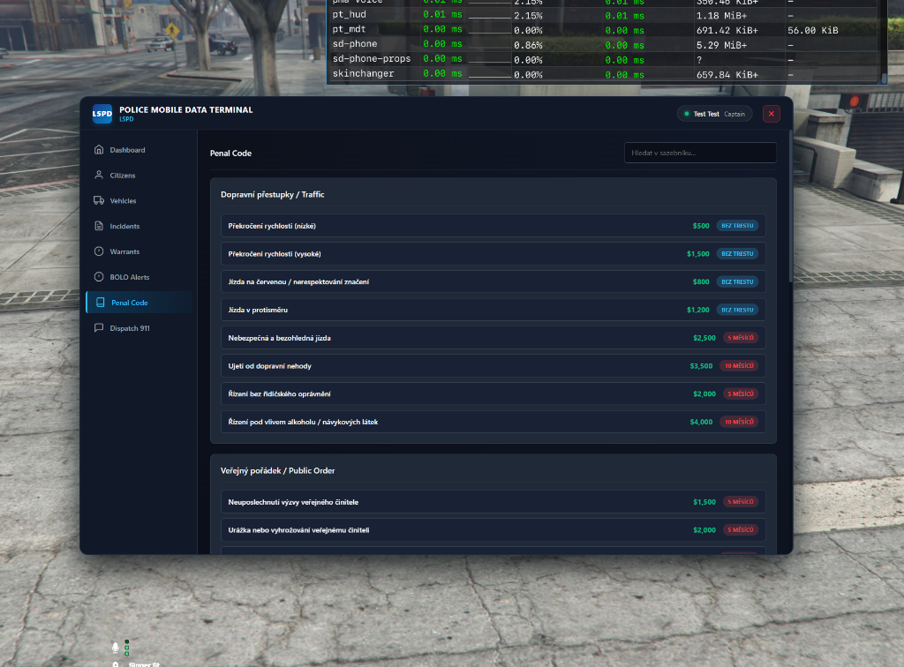
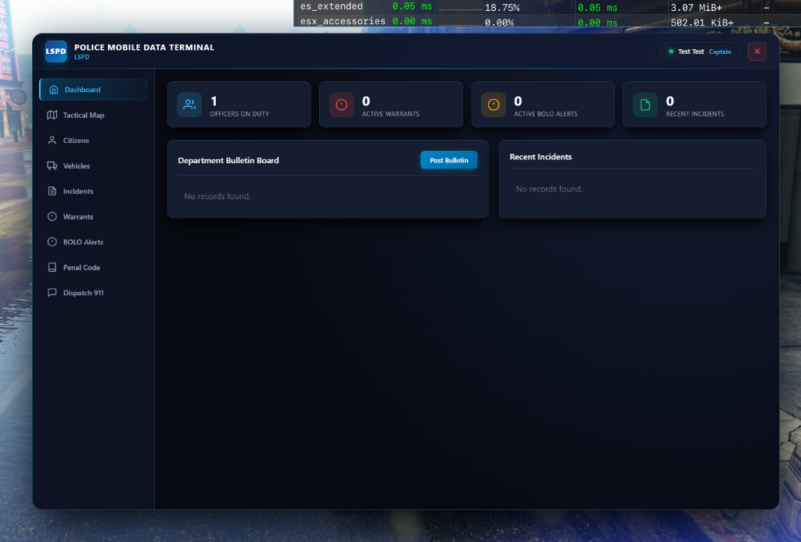
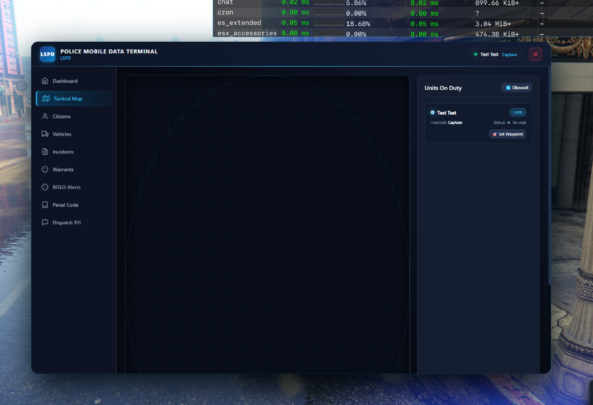
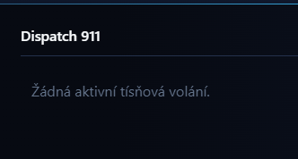

# 🚨 PT_MDT - Advanced Police Mobile Data Terminal & Dual Radar

<div align="center">
  
  <h3>Modern, Fast & Production-Ready Police CAD / MDT for FiveM (ESX Legacy & ox_inventory)</h3>

  [](https://fivem.net/)
  [](https://esx-framework.org/)
  [](https://github.com/overextended/ox_inventory)
  [](https://github.com/overextended/ox_lib)
  [](LICENSE)
</div>

---

## 📸 Screenshots Showcase

<div align="center">
  <h4>Tactical Live GPS Map (Leaflet.js HD Offline Vector Map)</h4>
  
  
  <br/><br/>
  
  <h4>Citizen Database, NCIC Records & Direct License Management</h4>
  

  <br/><br/>

  <h4>Dashboard & Incident Management</h4>
  

  <br/><br/>

  <h4>Stalker Dual DSR Police In-Vehicle Speed Radar HUD</h4>
  
</div>

---

## 📖 Overview

**pt_mdt** is a comprehensive, modern Mobile Data Terminal (MDT / CAD) built specifically for FiveM police roleplay. Designed from the ground up for ESX Legacy and `ox_inventory`, it requires zero build steps or NodeJS bundling — download, configure, and launch directly.

### 🌐 Built-in Multi-Language Support
- 🇬🇧 **English (`en`)**
- 🇨🇿 **Czech (`cs`)**
- 🇩🇪 **German (`de`)**

---

## ✨ Features

- 📱 **Physical Hardware Tablet (`mdt_tablet`)**:
  - MDT is opened exclusively via the inventory tablet item (usable on foot with a realistic holding animation, or directly inside vehicles).
- 🗺️ **Full HD Tactical GPS Live Map (Leaflet.js)**:
  - High-definition 8192x8192 offline GTA V world map with custom CRS coordinates.
  - Real-time live blips and status tracking for all active Police and EMS personnel (vehicle vs. foot status, heading, unit grade).
  - Quick-jump navigation to Los Santos, Sandy Shores, and Paleto Bay.
  - Instant one-click GPS waypoint navigation.
- 🎯 **Stalker Dual DSR In-Vehicle Speed Radar**:
  - Front and rear antenna target scanning utilizing native shape-test capsules.
  - Displays patrol speed, target speed, and automated target license plate recognition.
  - **Fast Lock**: Lock fast targets with `NUMPAD8` (`/radarlock`) accompanied by frontend audio alerts.
  - **Auto Power-Save**: Exiting the police vehicle automatically hides the radar HUD. Scanning resumes automatically when the officer returns to the driver's seat.
  - **Custom HUD Positioning (`/radarset` & `/radarreset`)**: Each player can drag and place the radar anywhere on their screen. Automatically resets to default bottom-right on server restart.
- 🪪 **Citizen Records & Direct License Management**:
  - Full citizen lookup by name, surname, or citizen ID.
  - Direct license management: grant or revoke driver (Class B), motorcycle (Class A), truck (Class C), and weapon licenses directly in MDT (`user_licenses`).
  - Criminal convictions history, photo mugshot URL, and confidential officer notes.
- 🚘 **DMV Vehicle Registry**:
  - Search by license plate (SPZ), view registered owner, toggle stolen vehicle status, and append internal notes.
- ⚖️ **Incidents & Multilingual Penal Code**:
  - Log multi-officer and multi-suspect incident reports.
  - 5-category comprehensive penal code completely localized into English, Czech, and German.
  - Automated cumulative fine calculation and prison sentencing with billing dispatch.
- 📜 **Warrants & BOLO Broadcasts**:
  - Issue active arrest warrants with probable cause.
  - Urgent BOLO broadcasts for wanted persons and vehicles.
- 📻 **911 Emergency Dispatch**:
  - Live call feed with caller identification and one-click GPS route targeting.

---

## 📦 Requirements

- [es_extended](https://github.com/esx-framework/esx_core) (ESX Legacy)
- [oxmysql](https://github.com/overextended/oxmysql)
- [ox_lib](https://github.com/overextended/ox_lib)
- [ox_inventory](https://github.com/overextended/ox_inventory)

---

## 🚀 Installation

### 1. Clone or Download Repository
Clone this repository into your FiveM server's resources directory:
```bash
cd resources/[pt_scripts]
git clone https://github.com/Petr1209/pt_mdt.git
```

### 2. Database Setup
Execute the provided `install.sql` file in your database manager (HeidiSQL, phpMyAdmin, etc.), or allow the script to automatically verify and create all tables upon first server startup.

### 3. Add Item to `ox_inventory`
Add the item entry into `ox_inventory/data/items.lua`:
```lua
['mdt_tablet'] = {
    label = 'Police MDT Tablet',
    weight = 1000,
    stack = false,
    close = true,
    description = 'Mobile police terminal for accessing citizen records, DMV, warrants, and dispatch.',
    client = {
        image = 'mdt_tablet.png'
    }
},
```

### 4. Item Image
Copy the bundled `mdt_tablet.png` from the root of this resource into:
```
resources/ox_inventory/web/images/mdt_tablet.png
```

### 5. Server Configuration (`server.cfg`)
Ensure the resource in your `server.cfg` in the following order:
```cfg
ensure ox_lib
ensure oxmysql
ensure ox_inventory
ensure pt_mdt
```

---

## 🎮 Controls & Commands

| Command / Key | Description |
|---|---|
| `mdt_tablet` (Item) | Opens the police MDT tablet |
| `NUMPAD9` / `/radar` | Toggles in-vehicle speed radar on/off |
| `NUMPAD8` / `/radarlock` | Locks current target vehicle speed |
| `/radarset` | Enables mouse drag mode to reposition the radar HUD |
| `/radarreset` | Reverts radar HUD back to default position |

---

## ⚙️ Configuration (`shared/config.lua`)

```lua
-- Language setting: 'en', 'cs', or 'de'
Config.Locale = 'en'

-- Authorized police jobs and permissions
Config.AllowedJobs = {
    ['police'] = { label = 'Police Department', badge = 'LSPD', canIssueWarrant = true, canSendToJail = true },
    ['sheriff'] = { label = 'Sheriff Office', badge = 'LSSD', canIssueWarrant = true, canSendToJail = true }
}
```

---

## 📡 Developer API & Exports

Send custom 911 emergency calls to the MDT dispatch tab from any external script (e.g. store robberies, bank heists):

```lua
-- Server-side export
exports['pt_mdt']:SendDispatch({
    code = '10-31',
    title = 'Vangelico Jewelry Heist',
    message = 'Silent security alarm triggered, armed suspects on scene.',
    caller = 'Store Security System',
    coords = vector3(-631.5, -237.4, 38.0)
})
```

---

## 📜 License

This project is licensed under the MIT License - see the [LICENSE](LICENSE) file for details.  
Developed for the FiveM community by **pt_scripts (Petr1209)**.
