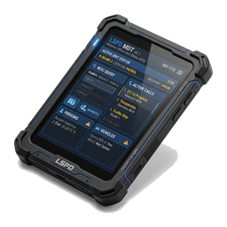

# 🚨 PT_MDT - Advanced Police Mobile Data Terminal & Dual Radar

<div align="center">
  
  <h3>Modern, Fast & Standalone-Ready Police CAD / MDT for FiveM (ESX Legacy & ox_inventory)</h3>

  [](https://fivem.net/)
  [](https://esx-framework.org/)
  [](https://github.com/overextended/ox_inventory)
  [](https://github.com/overextended/ox_lib)
  [](LICENSE)
</div>

---

## 🌐 Languages / Jazyky
- 🇨🇿 **Čeština (`cs`)**
- 🇬🇧 **English (`en`)**
- 🇩🇪 **Deutsch (`de`)**

---

## ✨ Features (English)

- 📱 **Hardware Tablet Item (`mdt_tablet`)**:
  - MDT is operated exclusively through the in-game tablet item (usable anywhere and inside vehicles).
  - Realistic 3D prop holding animation on foot.
- 🗺️ **Full HD Tactical GPS Live Map (Leaflet.js)**:
  - High-resolution (8192x8192) offline GTA V satellite vector map.
  - Real-time GPS beacon tracking for on-duty Police and EMS units (patrol vehicle vs. foot status, heading angle, job grade).
  - Quick camera jump controls: Los Santos, Sandy Shores, Paleto Bay.
  - One-click GPS navigation waypoint setting to any officer or emergency call.
- 🎯 **Stalker Dual DSR Police Speed Radar HUD**:
  - Integrated police vehicle radar scanning front and rear targets via native shape-test capsules.
  - Patrol speed, Target speed, and real-time license plate detection.
  - **Fast Lock**: Lock fast targets with `NUMPAD8` (`/radarlock`) with audible front-end audio alerts.
  - **Auto Power-Save**: When an officer steps out of the vehicle, the radar instantly hides. When re-entering the driver seat, scanning resumes seamlessly.
  - **Custom HUD Positioning (`/radarset` & `/radarreset`)**: Each officer can drag & drop the radar anywhere on their screen. Persists per-client and resets cleanly to default upon server restart.
- 🪪 **Citizen Management & License Registry**:
  - Search citizens by name, surname, or citizen ID.
  - Direct license management: view, grant, and revoke driver (Class B), motorcycle (Class A), truck (Class C), and weapon licenses directly in MDT (`user_licenses`).
  - Full criminal convictions record, mugshot URL, and confidential officer notes.
- 🚘 **DMV Vehicle Database**:
  - Instant plate search, registered owner profile shortcut, stolen flag toggle, and vehicle notes.
- ⚖️ **Incidents, Reports & Multilingual Penal Code**:
  - Multi-suspect and officer incident logging.
  - Fully categorized penal code (Traffic, Public Order, Property, Violence, Drugs & Weapons) translated into English, Czech, and German.
  - Automatic calculation of cumulative fines and prison terms with automatic bill/jail dispatching.
- 📜 **Warrants & BOLO Alerts**:
  - Issue active arrest warrants and urgent BOLO broadcasts for dangerous individuals or vehicles.
- 📻 **911 Dispatch Feed**:
  - Real-time dispatch call feed with direct GPS targeting.

---

## ✨ Klíčové funkce (Česky)

- 📱 **Realistický tablet (`mdt_tablet`)**:
  - MDT se otevírá výhradně pomocí položky v inventáři (jak pěšky s animací držení tabletu v ruce, tak i uvnitř vozidla).
- 🗺️ **Taktická Full HD GPS mapa (Leaflet.js)**:
  - Kompletní offline GTA V mapa ve vysokém rozlišení 8192x8192 bez nutnosti externích webových závislostí.
  - Živé sledování hlídek Policie a záchranářů EMS v reálném čase (ve voze / pěší, úhel natočení, hodnost).
  - Tlačítka pro rychlé zaměření: Los Santos, Sandy Shores, Paleto Bay a GPS zaměření libovolné jednotky.
- 🎯 **Policejní duální radar Stalker DSR**:
  - Měření rychlosti předního i zadního cíle (přední a zadní anténa) a čtení SPZ.
  - Uzamknutí rychlosti: klávesa `NUMPAD8` (`/radarlock`) se zvukovým signálem.
  - **Inteligentní skrytí**: při vystoupení z vozu se radar automaticky skryje a po nastoupení zpět na sedadlo řidiče opět aktivuje.
  - **Vlastní pozice (`/radarset` a `/radarreset`)**: každý hráč si může radar přetáhnout myší kamkoliv na obrazovku. Pozice se po restartu serveru bezpečně vrací do výchozího stavu.
- 🪪 **Evidence občanů a správa licencí**:
  - Vyhledávání osob, fotografie (mugshot), trestní rejstřík a poznámky.
  - Možnost přímo z karty občana udělovat a odebírat licence (řidičský průkaz sk. B, A, C i zbrojní průkaz).
- 🚘 **Registr vozidel DMV**:
  - Kontrola SPZ, propojení na majitele, označení odcizeného vozidla a poznámky.
- ⚖️ **Incidenty a kompletní trestní sazebník**:
  - Vyšetřovací spisy, automatický výpočet pokuty a měsíců vězení, automatické stržení pokuty z účtu.
  - Plně lokalizovaný trestní sazebník v `shared/penal_code.lua`.
- 📜 **Zatykače a BOLO pátrání**:
  - Vystavování a správa aktivních zatykačů a BOLO hlášení po vozidlech/osobách.

---

## 📦 Požadavky / Requirements

- [es_extended](https://github.com/esx-framework/esx_core) (ESX Legacy)
- [oxmysql](https://github.com/overextended/oxmysql)
- [ox_lib](https://github.com/overextended/ox_lib)
- [ox_inventory](https://github.com/overextended/ox_inventory)

---

## 🚀 Instalace / Installation

### 1. Stažení
Naklonujte repozitář do složky `resources/[pt_scripts]/pt_mdt`:
```bash
cd resources/[pt_scripts]
git clone https://github.com/it-petrfila/pt_mdt.git
```

### 2. Databáze
Spusťte soubor `install.sql` ve vašem databázovém manažeru (HeidiSQL / phpMyAdmin), nebo nechte skript vytvořit tabulky automaticky při prvním spuštění serveru.

### 3. Položka v `ox_inventory`
Přidejte definici položky do `ox_inventory/data/items.lua`:
```lua
['mdt_tablet'] = {
    label = 'Police MDT Tablet',
    weight = 1000,
    stack = false,
    close = true,
    description = 'Mobilní policejní terminál pro přístup k evidenci občanů, vozidel a zatykačů.',
    client = {
        image = 'mdt_tablet.png'
    }
},
```

### 4. Obrázek položky
Zkopírujte přiložený obrázek `mdt_tablet.png` z kořenové složky skriptu do:
```
resources/ox_inventory/web/images/mdt_tablet.png
```

### 5. Spuštění v `server.cfg`
```cfg
ensure ox_lib
ensure oxmysql
ensure ox_inventory
ensure pt_mdt
```

---

## 🎮 Klávesové zkratky a příkazy / Commands & Controls

| Příkaz / Klávesa | Popis (CS) | Description (EN) |
|---|---|---|
| `mdt_tablet` (Item) | Otevře policejní tablet | Opens police MDT tablet |
| `NUMPAD9` / `/radar` | Zapne / vypne policejní radar | Toggles speed radar on/off |
| `NUMPAD8` / `/radarlock` | Uzamkne změřenou rychlost cíle | Locks target speed |
| `/radarset` | Umožní přetáhnout radar myší | Allows dragging radar HUD |
| `/radarreset` | Vrátí radar do výchozí pozice | Resets radar HUD position |

---

## ⚙️ Konfigurace / Configuration (`shared/config.lua`)

```lua
Config.Locale = 'cs' -- 'cs' | 'en' | 'de'

Config.AllowedJobs = {
    ['police'] = { label = 'Police Department', badge = 'LSPD', canIssueWarrant = true, canSendToJail = true },
    ['sheriff'] = { label = 'Sheriff Office', badge = 'LSSD', canIssueWarrant = true, canSendToJail = true }
}
```

---

## 📡 API / Exporty

```lua
-- Odeslání tísňového volání z jiného skriptu (Server-side)
exports['pt_mdt']:SendDispatch({
    code = '10-31',
    title = 'Přepadení klenotnictví',
    message = 'Spuštěn tichý alarm, podezřelí ozbrojeni',
    caller = 'Bezpečnostní systém',
    coords = vector3(-631.5, -237.4, 38.0)
})
```

---

## 📜 Licence
Tento projekt je licencován pod licencí MIT - viz soubor [LICENSE](LICENSE).  
Vyvinuto pro komunitu od **pt_scripts (it-petrfila)**.
